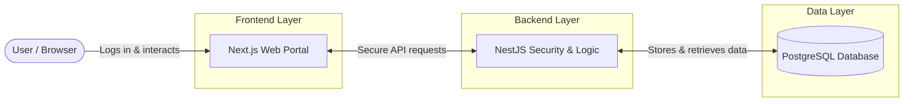
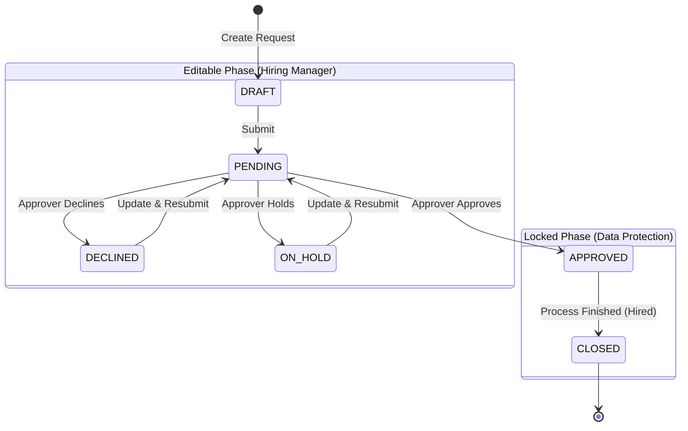
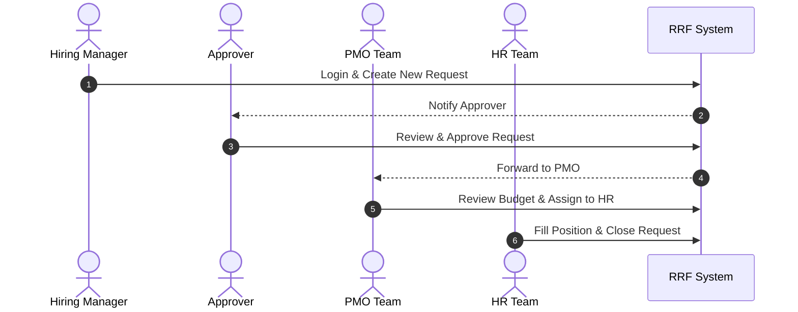

# RRF System Architecture & Workflow Overview

This document provides a high-level, easy-to-understand overview of the Recruitment Request Form (RRF) Portal. It is designed to clearly communicate how the system operates, the flow of a request, and exactly how data moves across different user roles.

---

## 1. High-Level System Architecture

This diagram shows the simple, three-tier architecture of our application. 
- **Frontend (Next.js):** The user-friendly interface where stakeholders log in and work.
- **Backend (NestJS):** The engine that enforces security rules and business logic.
- **Database (PostgreSQL):** The secure vault where all request histories and user data are permanently stored.

---

## 2. Request Lifecycle & Editability Restrictions

This workflow highlights the journey of a recruitment request. 
- **Editable Phase:** Hiring Managers can safely revise requests that are drafted, pending, declined, or on hold.
- **Locked Phase:** Once a request receives formal Approval, the system locks the data to prevent unauthorized changes, ensuring complete data integrity.

---

## 3. End-to-End System Sequence Flow

A streamlined view of how a request moves from department to department.
- The system automatically coordinates hand-offs, routing the request from the Hiring Manager to Approvers, then to the PMO, and finally to HR for closure.

---

## 4. Key Benefits to the Business

1. **Enhanced Security & Privacy:** JWT-based authentication combined with strict Role-Based Access ensures that sensitive hiring data is only visible to the right people at the right time.
2. **Ironclad Workflow Control:** Automated locking mechanisms protect approved requests from retrospective changes, eliminating miscommunication or off-the-record tampering.
3. **Operational Efficiency:** By digitizing the end-to-end recruitment process, we replace fragmented email chains with a centralized, real-time, and auditable pipeline.
